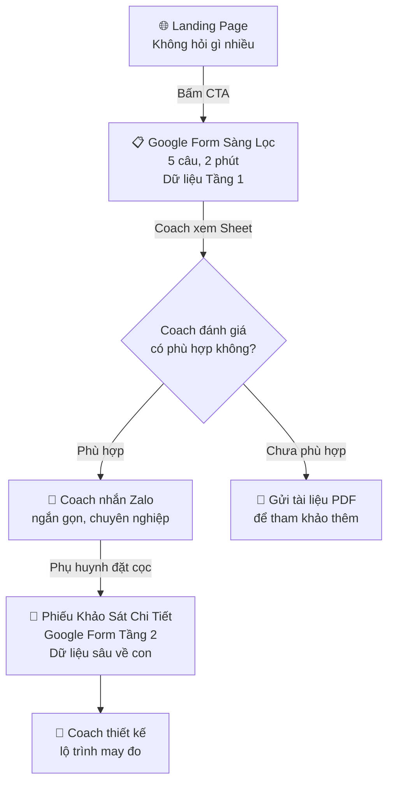

# Chiến Lược Thu Thập Dữ Liệu & Định Vị Cao Cấp

## Nguyên tắc tổng: "Không bán khóa học. Nhận đồng hành."

Mọi thứ trên website phải tạo cảm giác: **Coach đang chọn học viên**, chứ không phải khách hàng đang mua hàng.

---

## 1. Phễu Thu Thập Dữ Liệu — 3 Tầng Tin Tưởng

> Phụ huynh chỉ chia sẻ dữ liệu về con khi đã tin tưởng. Nên chia việc thu thập thành 3 tầng:



### Tầng 1 — Google Form Sàng Lọc (trước khi nhắn tin)
**Mục đích**: Lọc khách chất lượng, tránh chat chit. Coach chỉ nhắn Zalo cho người đã điền form.

| # | Câu hỏi | Loại | Mục đích |
|---|---|---|---|
| 1 | Họ tên phụ huynh | Text ngắn | Xưng hô |
| 2 | Số Zalo để Coach liên hệ | Text ngắn | Kênh liên lạc duy nhất |
| 3 | Con đang học lớp mấy? | Trắc nghiệm: Lớp 6-8 / Lớp 9 / Lớp 10-11 / Lớp 12 | Phân loại đối tượng |
| 4 | Con hiện dùng thiết bị chủ yếu để làm gì? | Trắc nghiệm: Lướt TikTok-YouTube / Chơi game / Học online / Chưa dùng nhiều | Hiểu painpoint |
| 5 | Anh/chị mong muốn gì nhất cho con? | Text ngắn (tùy chọn) | Hiểu động lực mua |

> **Lưu ý**: KHÔNG hỏi ngân sách, thu nhập, hay thông tin cá nhân con. Quá sớm = mất niềm tin.

### Tầng 2 — Phiếu Khảo Sát Chi Tiết (sau khi đặt cọc)
Chỉ gửi khi phụ huynh đã tin tưởng và cam kết. Câu hỏi sâu hơn:
- Con tên gì, sở thích cá nhân là gì?
- Con giỏi môn nào, yếu môn nào?
- Mục tiêu học tập trước mắt (thi vào 10? du học?)
- Con đang dùng thiết bị gì? (laptop/tablet/specs)
- Thời gian rảnh trong tuần

→ Dữ liệu này là nguyên liệu để Coach thiết kế lộ trình may đo.

### Tầng 3 — Buổi 1 (khai vấn trực tiếp)
Coach và con gặp nhau buổi đầu tiên, Coach quan sát trực tiếp:
- Con giao tiếp thế nào?
- Mức độ tự tin với công nghệ?
- Phong cách học (visual? hands-on? theory?)

---

## 2. Trên Website: Thay Form HTML bằng CTA → Google Form

### Bỏ gì:
- ❌ Form HTML 4 fields hiện tại (dữ liệu chỉ lưu localStorage = vô nghĩa)
- ❌ Label "ƯU ĐÃI KHÓA ĐẦU" (nghe giảm giá = mass market)
- ❌ Nút "Gửi Đăng Ký" (nghe mua hàng)

### Thay bằng:
- ✅ **Nút lớn "Gửi Đơn Ứng Tuyển"** → mở Google Form (tab mới)
- ✅ Label **"NHẬN HỌC VIÊN MỚI"** (Coach chọn học viên, không phải bán)
- ✅ Ghi rõ: "Chỉ nhận tối đa 5 học viên cùng lúc" (giới hạn thật)
- ✅ **Nút Zalo phụ**: cho ai muốn hỏi nhanh trước

### CTA mới trên mobile bottom bar:
```
[ 💬 Zalo Coach ]  [ 📋 Gửi Đơn Ứng Tuyển ]
```

---

## 3. Để Khách Tự Định Giá Cao — Không Cần Hiện Giá

### Nguyên tắc: "Giá trị hiển nhiên thì không cần nói giá"

Khi phụ huynh đọc xong trang web, họ phải tự kết luận: *"Cái này chắc không rẻ đâu. Nhưng đáng."*

**Tín hiệu giá trị cao đã có:**
- ✅ 1-kèm-1 (không phải lớp 30 người)
- ✅ Bao gồm tài khoản AI Pro (= Coach bỏ tiền thật)
- ✅ Có sản phẩm thật, Demo Day (= kết quả sờ thấy được)
- ✅ Phương pháp riêng (3 trụ cột Meta, Dialog Engineering)
- ✅ Báo cáo định kỳ cho phụ huynh

**Tín hiệu giá trị cao CẦN THÊM:**
- "Chỉ nhận tối đa 5 học viên cùng lúc" → giới hạn thật (Coach 1 người, 1 ngày chỉ dạy được 2-3 buổi)
- "Mỗi lộ trình được thiết kế từ đầu" → không template
- "Gửi đơn ứng tuyển" thay vì "đăng ký mua" → bạn phải được chọn
- KHÔNG hiện giá → giá chỉ trao đổi sau khi Coach hiểu nhu cầu

---

## 4. Tiếp Cận Tệp Khách Giàu & Hiểu Biết

### Kênh phân phối:
Mô hình bespoke = **giới thiệu nồng** (warm referral), không phải quảng cáo đại trà.

| Kênh | Cách làm |
|---|---|
| **Mối quan hệ thân quen** | Gửi link trang web + tin nhắn ngắn gọn (đã có kịch bản Zalo) |
| **Phụ huynh của học viên hiện tại** | Sau Demo Day, phụ huynh tự chia sẻ cho bạn bè |
| **Nhóm Zalo/Facebook phụ huynh trường quốc tế** | Chia sẻ bài viết Case Study (không bán hàng trực tiếp) |
| **LinkedIn cá nhân** | Đăng bài về triết lý dạy AI, thu hút phụ huynh là người đi làm |

### Tệp khách giàu KHÔNG muốn thấy:
- ❌ "Giảm 50%!", "Chỉ còn 3 suất!", countdown timer
- ❌ Lời hứa thu nhập ("Kiếm tiền từ AI")
- ❌ Doạ dẫm ("Nếu không học, con sẽ thất nghiệp!")
- ❌ Testimonial giả, ảnh stock sến

### Tệp khách giàu MUỐN thấy:
- ✅ Phương pháp rõ ràng, có chiều sâu trí tuệ
- ✅ Website đẹp, chuyên nghiệp, không lỗi chính tả
- ✅ Coach có hệ thống tư duy riêng (Meta pillars, Dialog Engineering)
- ✅ Case study thật (khi có)
- ✅ Cảm giác "đây là dịch vụ premium, không phải hàng chợ"

---

## 5. Chống "Lùa Gà" — Checklist

| Đặc điểm "lùa gà" | Chúng ta làm ngược lại |
|---|---|
| Đánh vào lòng tham: "Kiếm tiền từ AI!" | Đánh vào giá trị thật: "Con tự tay làm ra sản phẩm" |
| Đánh vào sợ hãi: "Không học sẽ thất nghiệp!" | Đánh vào khát vọng: "Biến thời gian màn hình thành kỹ năng" |
| Đánh vào thiếu hiểu biết: "AI sẽ thay thế tất cả!" | Giải thích rõ: "AI là nhân sự mới, cần học cách dẫn dắt" |
| CTA: "MUA NGAY!" | CTA: "Gửi đơn ứng tuyển" |
| Urgency: "Còn 3 suất!" | Exclusivity: "Chỉ nhận 5 học viên cùng lúc" |
| Giảm giá, combo, flash sale | Không hiện giá. Trao đổi sau khi hiểu nhu cầu |

---

## Tóm Lại — 3 Việc Cần Làm Ngay

1. **Tạo Google Form 5 câu** (Coach tự tạo trên forms.google.com, copy câu hỏi từ Tầng 1 ở trên)
2. **Cập nhật website**: Bỏ HTML form → Thay bằng 2 nút CTA (Google Form + Zalo) + cập nhật ngôn ngữ "ứng tuyển" thay vì "đăng ký"
3. **Chuẩn bị Google Form Tầng 2** (phiếu khảo sát chi tiết, gửi sau khi nhận cọc)

> [!IMPORTANT]
> Anh cần tạo Google Form trước, rồi gửi cho tôi **link chia sẻ** của form đó. Tôi sẽ gắn vào website ngay.
> Nếu chưa tạo, tôi sẽ dùng link placeholder trước và anh thay sau.
