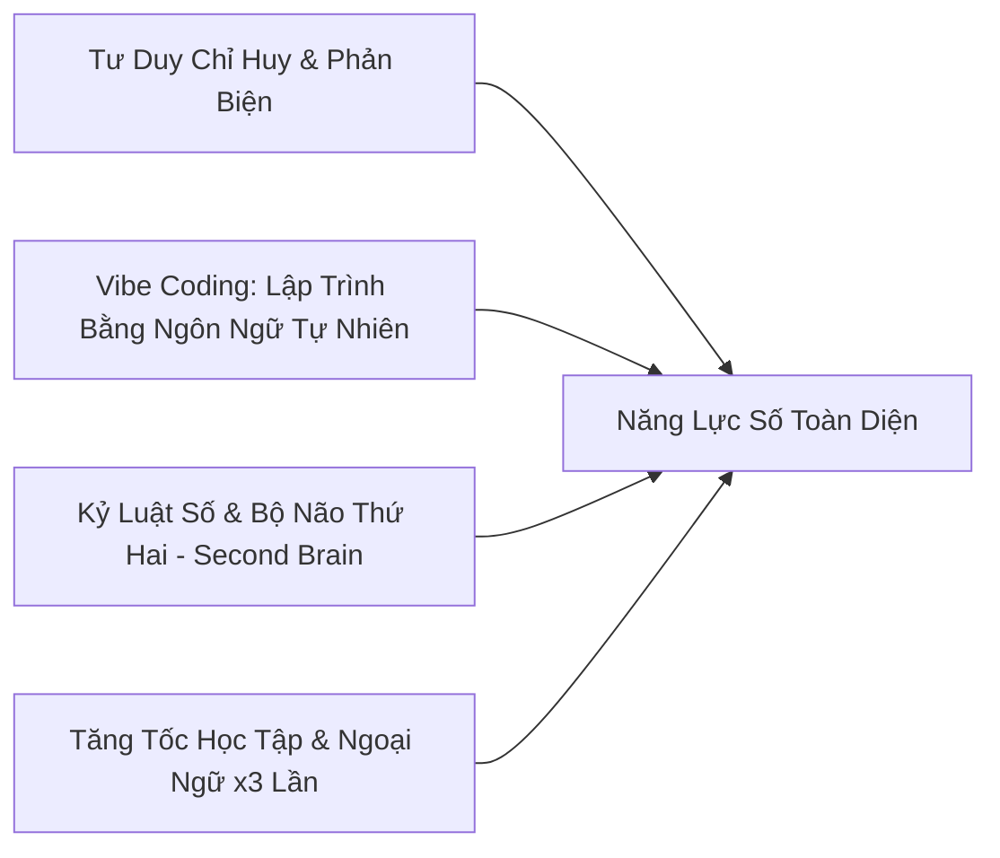

# CHƯƠNG TRÌNH HUẤN LUYỆN CÁ NHÂN (BESPOKE PRIVATE COACHING)
## "Từ Người Tiêu Thụ Thiết Bị Đến Người Chỉ Huy Công Nghệ"
**Dành riêng cho học sinh Cấp 2 (THCS) & Cấp 3 (THPT)**

---

> ### 💡 THÔNG ĐIỆP GỬI QUÝ PHỤ HUYNH:
> **"Cấm đoán công nghệ là cách nhanh nhất biến con thành người tụt hậu. Dạy con làm chủ và chỉ huy công nghệ là bệ phóng vững chắc nhất cho tương lai."**

---

## I. GIẢI MÃ 2 NỖI LO LỚN NHẤT CỦA PHỤ HUYNH VỀ A.I

### ❌ Nỗi lo 1: "Sợ con nghiện A.I như nghiện Game, cắm mặt vào màn hình?"
* **Thực tế:** Trẻ nghiện game/mạng xã hội vì ở đó trẻ là **"Người tiêu thụ thụ động"** (bị các thuật toán giải trí dắt mũi).
* **Giải pháp của Coach:** Chúng tôi chuyển hóa 100% thời gian màn hình của con thành **"Chế độ Nhà sáng tạo" (Creator Mode)**. Con dùng năng lượng và sự tò mò của mình để tự làm game, lập trình web, sáng tác nhạc và xuất bản video. Khi con tự tạo ra sản phẩm, con sẽ nhìn thiết bị với con mắt của một **"Kỹ sư / Giám đốc dự án"** thay vì một người chơi game đơn thuần.

---

### ❌ Nỗi lo 2: "Cái gì cũng hỏi A.I thì con có bị lười suy nghĩ, bị 'ngu đi' không?"
* **Thực tế:** Nếu dùng AI để "chép bài giải mẫu" thì chắc chắn não bộ sẽ lười đi. Nhưng đó là cách dùng của người không có phương pháp.
* **Giải pháp của Coach:** Con được rèn luyện phương pháp **AI Socratic (Khai vấn ngược)**:
  1. Con không được phép bảo AI làm hộ, mà con phải học cách **Phân tích vấn đề** và **Ra lệnh chính xác (Prompt Engineering)**.
  2. Con phải đóng vai trò **Thẩm phán & Người kiểm chứng**: Đặt câu hỏi phản biện, phát hiện lỗi sai và đánh giá độ chính xác của câu trả lời từ AI.
  3. AI trở thành một **"Gia sư riêng 24/7"** kèm con đào sâu bản chất môn học (Toán, Lý, Ngoại ngữ) chứ không phải cỗ máy chép bài.

---

## II. 4 NĂNG LỰC CỐT LÕI CON ĐẠT ĐƯỢC SAU KHÓA HUẤN LUYỆN

1. **Tư Duy Người Chỉ Huy (Prompt & Context Engineering):**
   * Con học cách diễn đạt mạch lạc, tư duy logic, cấu trúc hóa yêu cầu để điều khiển các hệ thống AI tiên tiến nhất hiện nay.

2. **Lập Trình Không Cần Gõ Code (Vibe Coding):**
   * Không bắt con học lý thuyết cú pháp khô khan. Con dùng ngôn ngữ tự nhiên để AI tự viết code, tạo ra các ứng dụng Web, Chatbot và Mini-game theo đúng sở thích cá nhân.

3. **Kỷ Luật Số & "Bộ Não Thứ Hai" (Second Brain):**
   * Hướng dẫn con thiết lập hệ thống ghi chép và quản lý tri thức khoa học (Obsidian/Notion). Rèn luyện thói quen tự lập kế hoạch học tập, quản lý thời gian và cai nghiện lướt mạng vô bổ.

4. **Tăng Tốc Học Tập & Luyện Thi:**
   * Ứng dụng AI để tóm tắt kiến thức, tạo sơ đồ tư duy, giải đề luyện thi (vào 10 / THPT Quốc Gia) và luyện nói Ngoại ngữ (Tiếng Anh/Tiếng Trung) 1-kèm-1 không giới hạn thời gian.

---

## III. CÁC GÓI ĐẦU TƯ & SẢN PHẨM ĐẦU RA THỰC TẾ (100% CÓ SẢN PHẨM)

*Tất cả các gói học đều theo hình thức **1-kèm-1** (hoặc nhóm tối đa 2 bạn thân) và **đã bao gồm trọn gói chi phí tài khoản bản quyền các hệ thống AI chuyên nghiệp trong suốt lộ trình. Gia đình không phải chi trả thêm bất kỳ khoản phí phần mềm phát sinh nào.***

| Gói Huấn Luyện | Thời Lượng | Mục Tiêu & Sản Phẩm Đầu Ra |
| :--- | :--- | :--- |
| **GÓI 1: KHỞI ĐỘNG (Nền Tảng & Sáng Tạo Số)** | **1 Tháng** (8 buổi / 90p) | • Định hình kỷ luật số, xây dựng "Second Brain" cá nhân. • Làm chủ AI hình ảnh, âm thanh, video. • **Sản phẩm bàn giao:** 01 Kênh nội dung/Video cá nhân chất lượng cao về chủ đề con yêu thích. |
| **GÓI 2: KIẾN TẠO (Vibe Coding & Ứng Dụng)** ⭐ *(Khuyên dùng)* | **2 Tháng** (16 buổi / 90p) | • Toàn bộ quyền lợi của Gói 1. • Học tư duy Kiến trúc sư phần mềm (Vibe Coding). • **Sản phẩm bàn giao:** 01 Ứng dụng Web / Chatbot Trợ lý học tập cá nhân chạy thực tế trên Internet để báo cáo Demo Day. |
| **GÓI 3: TOÀN DIỆN (Hệ Thống & Bứt Phá)** | **3 Tháng** (24 buổi / 90p) | • Toàn bộ quyền lợi Gói 1 & Gói 2. • Tích hợp sâu vào chương trình luyện thi, Portfolio cá nhân săn học bổng / du học. • **Sản phẩm bàn giao:** Hệ thống tự động hóa học tập toàn diện + Portfolio dự án công nghệ. |

---

## IV. CAM KẾT ĐỒNG HÀNH DÀNH CHO PHỤ HUYNH

* 📊 **Báo cáo định kỳ:** Sau mỗi 4 buổi, Coach gửi báo cáo chi tiết về sự thay đổi thói quen, mức độ tiếp thu và tiến độ sản phẩm của con.
* 🕒 **Linh hoạt & Kèm sát:** Lịch học được sắp xếp theo thời khóa biểu của con. Kênh hỗ trợ riêng giải đáp thắc mắc 24/7.
* 🎯 **Cam kết đầu ra:** 100% con tự tay xây dựng được sản phẩm thật, chạy được thật và tự tin thuyết trình về sản phẩm của mình.

---

## BƯỚC ĐẦU TIÊN: BUỔI ĐÁNH GIÁ NĂNG LỰC SỐ MIỄN PHÍ

Trước khi quyết định đăng ký, Coach trân trọng gửi tặng gia đình:  
👉 **01 Buổi "Chẩn Đoán Thói Quen Số & Định Hướng Lộ Trình 1-1" (30 Phút - Miễn phí)**

* Coach sẽ trực tiếp trò chuyện cùng phụ huynh và học sinh để đánh giá thực trạng sử dụng thiết bị, lắng nghe mục tiêu và thiết kế bản lộ trình học tập "may đo" riêng cho con.

📞 **Liên hệ trực tiếp Coach để đặt lịch:** [Số điện thoại / Zalo của bạn]  
🌐 **Chương trình:** Private AI Coach - AI Native Hub
